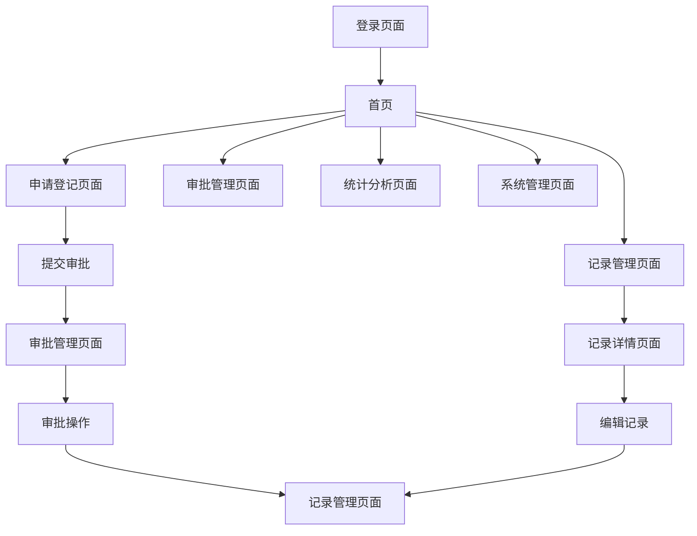

## 1. 产品概述
员工外出交流信息登记系统是一个专门用于管理企业员工外出交流、培训、会议等活动信息的数字化平台。该系统通过SSO单点登录实现统一身份认证，支持角色权限管理，提供完整的信息登记、审批、查询和文件管理功能。

系统主要解决企业外出交流信息管理混乱、审批流程不规范、信息查询困难等问题，帮助HR部门和管理层高效管理员工外出活动，提升企业管理效率。

## 2. 核心功能

### 2.1 用户角色
| 角色 | 注册方式 | 核心权限 |
|------|----------|----------|
| 普通员工 | SSO单点登录 | 提交外出申请、查看个人记录、上传附件 |
| 部门主管 | SSO单点登录 | 审批部门员工申请、查看部门统计、导出报表 |
| HR管理员 | SSO单点登录 | 管理所有记录、系统配置、权限管理、数据导出 |
| 系统管理员 | 后台配置 | 用户管理、角色分配、系统设置、日志查看 |

### 2.2 功能模块
系统主要包含以下核心页面：
1. **登录页面**：SSO单点登录入口，支持企业统一身份认证
2. **首页**：个人待办事项、快速申请入口、通知公告
3. **申请登记页面**：外出信息填写、附件上传、提交审批
4. **记录管理页面**：记录列表、搜索筛选、详情查看、编辑删除
5. **审批管理页面**：待审批列表、审批操作、审批历史
6. **统计分析页面**：数据可视化、报表导出、趋势分析
7. **系统管理页面**：用户管理、角色权限、系统配置

### 2.3 页面详情
| 页面名称 | 模块名称 | 功能描述 |
|----------|----------|----------|
| 登录页面 | SSO认证模块 | 集成企业SSO系统，支持扫码登录和账号密码登录 |
| 首页 | 个人工作台 | 显示待办审批、快速申请按钮、最新通知公告 |
| 首页 | 数据统计卡片 | 展示个人外出次数、部门统计、系统公告 |
| 申请登记页面 | 基本信息填写 | 填写外出类型、时间、地点、参与人员等基础信息 |
| 申请登记页面 | 详细内容编辑 | 编辑交流主题、预期成果、详细行程安排 |
| 申请登记页面 | 附件上传 | 支持上传相关文件、图片，支持多文件同时上传 |
| 申请登记页面 | 提交审批 | 选择审批人，提交申请并发送通知 |
| 记录管理页面 | 记录列表 | 分页显示所有记录，支持按条件筛选和排序 |
| 记录管理页面 | 搜索筛选 | 按时间、部门、状态、关键词等条件搜索 |
| 记录管理页面 | 记录操作 | 查看详情、编辑、删除、导出单条记录 |
| 审批管理页面 | 待审批列表 | 显示需要当前用户审批的申请列表 |
| 审批管理页面 | 审批操作 | 批准、驳回、转交审批，填写审批意见 |
| 审批管理页面 | 审批历史 | 查看历史审批记录和审批流程 |
| 统计分析页面 | 数据可视化 | 图表展示外出趋势、部门对比、类型分布 |
| 统计分析页面 | 报表导出 | 导出Excel、PDF格式的统计报表 |
| 系统管理页面 | 用户管理 | 添加用户、编辑信息、重置密码、分配角色 |
| 系统管理页面 | 角色权限 | 配置角色权限、设置菜单访问权限 |
| 系统管理页面 | 系统配置 | 配置外出类型、审批流程、通知设置 |

## 3. 核心流程

### 3.1 员工申请流程
员工通过SSO登录系统后，可以在首页点击"新建申请"进入申请页面。填写外出基本信息（类型、时间、地点、参与人员），详细描述交流内容和预期成果，上传相关附件文件，选择审批人后提交申请。系统会自动发送通知给审批人，员工可以在个人中心查看申请状态和审批进度。

### 3.2 审批流程
部门主管或HR管理员收到审批通知后，进入审批管理页面查看待审批列表。点击具体申请可查看详细信息，包括申请内容、附件材料等。审批人可以选择批准、驳回或转交他人审批，需要填写审批意见。审批完成后，系统会自动通知申请人和相关人员。

### 3.3 记录管理流程
所有外出交流记录都会在系统中保存，用户可以根据权限查看相应的记录。普通员工只能查看自己的记录，部门主管可以查看部门内所有记录，HR管理员可以查看全公司记录。支持按时间、部门、状态、关键词等条件进行搜索筛选，可以导出单条记录或批量导出数据。

## 4. 用户界面设计

### 4.1 设计风格
- **主色调**：深蓝色 (#1E3A8A) 作为主品牌色，浅灰色 (#F3F4F6) 作为背景色
- **辅助色**：绿色 (#10B981) 表示成功状态，橙色 (#F59E0B) 表示警告，红色 (#EF4444) 表示错误
- **按钮样式**：圆角矩形设计，主要按钮使用主色调，次要按钮使用边框样式
- **字体选择**：系统默认字体，标题使用16-18px，正文使用14px，小字使用12px
- **布局风格**：左侧导航菜单 + 右侧内容区域的经典管理后台布局
- **图标风格**：使用简洁的线性图标，保持视觉一致性

### 4.2 页面设计概览
| 页面名称 | 模块名称 | UI元素 |
|----------|----------|--------|
| 登录页面 | 认证区域 | 居中卡片布局，包含企业Logo、SSO登录按钮、简洁背景图案 |
| 首页 | 顶部导航 | 用户头像、退出登录、系统名称，深色导航栏设计 |
| 首页 | 工作台 | 卡片式布局展示统计数据，使用图表和数字结合的方式 |
| 申请登记页面 | 表单区域 | 分步骤表单设计，清晰的分组标题，必填项标识 |
| 申请登记页面 | 附件上传 | 拖拽上传区域，支持多文件预览，显示上传进度 |
| 记录管理页面 | 列表展示 | 表格形式展示，支持排序和筛选，操作按钮悬浮显示 |
| 记录管理页面 | 搜索区域 | 顶部搜索栏，多条件筛选器，导出按钮 |
| 审批管理页面 | 审批列表 | 状态标签区分不同状态，优先级标识，批量操作 |
| 统计分析页面 | 图表区域 | 多种图表类型切换，时间范围选择器，导出功能 |
| 系统管理页面 | 配置面板 | 标签页分组管理，表单验证，操作确认对话框 |

### 4.3 响应式设计
系统采用桌面端优先的设计策略，主界面针对1920x1080分辨率优化设计。同时支持平板设备（768px-1024px）的自适应显示，在移动端（小于768px）提供基础的查看功能。触摸交互方面，按钮和可点击区域保持最小44px的触摸目标，支持手势操作如滑动删除、长按多选等。

### 4.4 交互细节
- 表单验证：实时验证用户输入，错误提示明确显示
- 加载状态：操作按钮显示加载动画，禁用重复提交
- 通知提醒：操作成功/失败显示Toast提示，重要通知使用弹窗
- 批量操作：支持多选记录进行批量审批、导出等操作
- 快捷键：常用操作支持键盘快捷键，提升操作效率