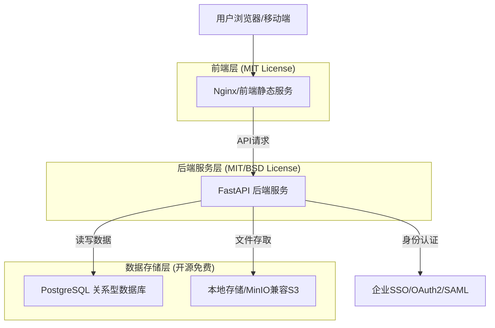

# 员工外出交流信息登记系统 - 技术架构文档

## 1. 架构设计

系统采用经典的前后端分离架构，所有选型均基于**开源且对大型企业免费商用**的技术栈，无任何供应商锁定（Vendor Lock-in）风险或商业授权费用。

## 2. 技术选型及开源协议评估

为了确保大型企业可以免费且合规地使用，系统所选用的所有核心组件均采用宽松的开源协议（如 MIT、Apache 2.0、BSD 或 PostgreSQL License）。

### 2.1 前端技术栈 (完全免费，MIT协议)
- **前端框架**: React@18 (MIT) + TypeScript (Apache 2.0)
- **构建工具**: Vite (MIT)
- **UI框架**: TailwindCSS@3 (MIT) + Headless UI (MIT) / Ant Design (MIT)
- **HTTP客户端**: Axios (MIT)
- **状态管理**: Zustand (MIT) 或 React Context

### 2.2 后端技术栈 (完全免费，MIT/BSD协议)
- **Web框架**: FastAPI (MIT) - 异步、高性能的 Python Web 框架
- **ASGI服务器**: Uvicorn (BSD)
- **数据校验**: Pydantic (MIT)
- **ORM框架**: SQLAlchemy (MIT)
- **数据库迁移**: Alembic (MIT)
- **认证授权**: Python-JOSE (MIT) + Authlib (BSD) (用于对接企业 SSO/SAML)

### 2.3 基础设施与存储 (企业免费)
- **关系型数据库**: PostgreSQL (PostgreSQL License) - 自由宽松，极其适合企业商用，无 GPL 传染风险。
- **文件存储**: 
  - 方案A：直接基于服务器本地文件系统 + Nginx 静态代理 (BSD)
  - 方案B：MinIO (需注意 AGPL v3 协议，若仅通过 API 调用且不修改源码，通常企业可用；若合规要求极高，可使用 Apache server 或 Ceph (LGPL))
- **反向代理**: Nginx (2-clause BSD-like)

---

## 3. 核心模块技术实现

### 3.1 SSO 单点登录集成
后端使用 `Authlib` 库与企业现有的 SSO (如 Keycloak, Okta 或自建的 OAuth2/SAML 平台) 进行对接。
- **流程**: 前端点击登录 -> 跳转至企业 SSO -> SSO 认证成功后携带 Code/Token 回调 FastAPI 接口 -> FastAPI 验证并获取员工工号信息 -> 签发本系统 JWT Token (或维护 Session)。
- **工号识别**: 从 SSO 返回的 Profile 中提取 `employee_id`，并自动在 PostgreSQL 中进行用户注册或更新。

### 3.2 数据库设计 (PostgreSQL)

系统包含以下核心数据表（采用 SQLAlchemy ORM 建模）：

1. **users (用户信息表)**
   - `id`: UUID (主键)
   - `employee_id`: VARCHAR (工号，唯一)
   - `name`: VARCHAR (姓名)
   - `department`: VARCHAR (部门)
   - `sub_department`: VARCHAR (二级部门)
   - `role`: VARCHAR (角色：普通用户 / 管理员)

2. **exchange_records (交流信息登记表)**
   - `id`: UUID (主键)
   - `submitter_id`: UUID (外键，关联 users)
   - `customer_name`: VARCHAR (客户名称)
   - `city`: VARCHAR (所在城市)
   - `submit_date`: DATE (提交日期)
   - `is_locked`: BOOLEAN (是否被管理员锁定)
   - `is_deleted`: BOOLEAN (软删除标记)

3. **participants (参与人表)**
   - `id`: UUID
   - `record_id`: UUID (外键，关联 exchange_records)
   - `type`: VARCHAR (本公司 / 对方公司)
   - `name_or_employee_id`: VARCHAR

4. **attachments (附件表)**
   - `id`: UUID
   - `record_id`: UUID (外键)
   - `file_name`: VARCHAR (原文件名)
   - `file_path`: VARCHAR (存储路径)
   - `file_type`: VARCHAR (MIME type)
   - `file_size`: INTEGER

5. **audit_logs (审计日志表)**
   - `id`: UUID
   - `operator_id`: UUID
   - `action`: VARCHAR (创建、修改、锁定、软删除等)
   - `target_record_id`: UUID
   - `created_at`: TIMESTAMP

### 3.3 文件存储与安全限制
- **上传机制**: 客户端将文件通过 `multipart/form-data` 上传至 FastAPI `/api/upload` 接口。
- **安全校验**:
  - 文件大小限制：FastAPI 中间件限制 Max Request Size (如 20MB)。
  - 文件类型限制：通过 `python-magic` 校验文件真实 MIME Type（不仅校验后缀），仅允许图片 (jpg, png) 和 PDF。
- **存储**: 后端生成 UUID 作为新文件名（防止路径遍历攻击），保存到挂载的专用数据盘目录中，将路径写入 `attachments` 表。

### 3.4 权限与数据隔离策略
- **普通用户**: 
  - 只能查询 `submitter_id` 为自己的记录。
  - 只能修改 `is_locked = False` 且属于自己的记录。
- **管理员**: 
  - 无视 `submitter_id` 拦截，可查看全量数据。
  - 拥有锁定/解锁接口的调用权限（由 FastAPI 的 Depends(get_current_admin_user) 依赖注入进行权限校验）。

---

## 4. API 接口设计 (FastAPI Swagger 自动生成)

FastAPI 原生支持基于 OpenAPI 规范自动生成 Swagger UI 文档。以下为核心路由划分：

- **Auth Router** (`/api/auth`)
  - `GET /login/sso` - 发起 SSO 登录
  - `GET /callback` - SSO 回调处理
  - `GET /me` - 获取当前用户信息和角色
- **Records Router** (`/api/records`)
  - `POST /` - 提交新的交流记录
  - `GET /` - 分页查询记录 (支持按城市、客户名、时间搜索)
  - `GET /{id}` - 获取详情
  - `PUT /{id}` - 修改记录 (拦截 locked 状态)
  - `DELETE /{id}` - 软删除记录
- **Admin Router** (`/api/admin`)
  - `POST /records/{id}/lock` - 锁定/解锁记录
  - `DELETE /records` - 批量硬删除或彻底清理
  - `GET /audit-logs` - 查看管理员操作审计日志
- **File Router** (`/api/files`)
  - `POST /upload` - 附件上传
  - `GET /download/{id}` - 附件下载验证权限后输出流
- **Export Router** (`/api/export`)
  - `POST /excel` - 接收勾选的记录 ID，使用 `pandas` 或 `openpyxl` 生成 Excel，返回文件流。

---

## 5. 质量保证与安全机制

### 5.1 安全防护 (企业级要求)
- **SQL注入防护**: 完全依赖 SQLAlchemy ORM 的参数化查询，杜绝拼接 SQL。
- **XSS攻击防护**: 
  - 后端 Pydantic 模型对输入文本进行清洗。
  - 前端 React 默认转义机制防止 XSS 渲染。
- **认证安全**: JWT HttpOnly Cookie 或 Authorization Header 传输，配置合适的过期时间。

### 5.2 性能优化 (针对数据导出)
- 对于大数据量的 Excel 导出，FastAPI 采用后台任务（`BackgroundTasks`）或流式响应（`StreamingResponse`）结合数据库游标（Server-side cursor）进行数据读取，避免内存溢出 (OOM)。

### 5.3 测试覆盖
- **单元测试**: 使用 `pytest` 和 `httpx` (FastAPI 的 TestClient) 进行接口层和业务逻辑层的单元测试。
- **集成测试**: 针对 SSO 回调和数据库事务进行端到端测试。

---

## 6. 部署建议

- **容器化部署**: 提供 `Dockerfile` 和 `docker-compose.yml`，一键部署前端 Nginx、后端 FastAPI 和 PostgreSQL。
- **高可用**: 
  - 前端：Nginx 配合企业内部 CDN 或负载均衡器。
  - 后端：通过 Gunicorn 运行多个 Uvicorn worker，利用 Kubernetes 或 Docker Swarm 进行水平扩展。
  - 数据库：PostgreSQL 主从高可用架构（企业 IT 部门提供）。