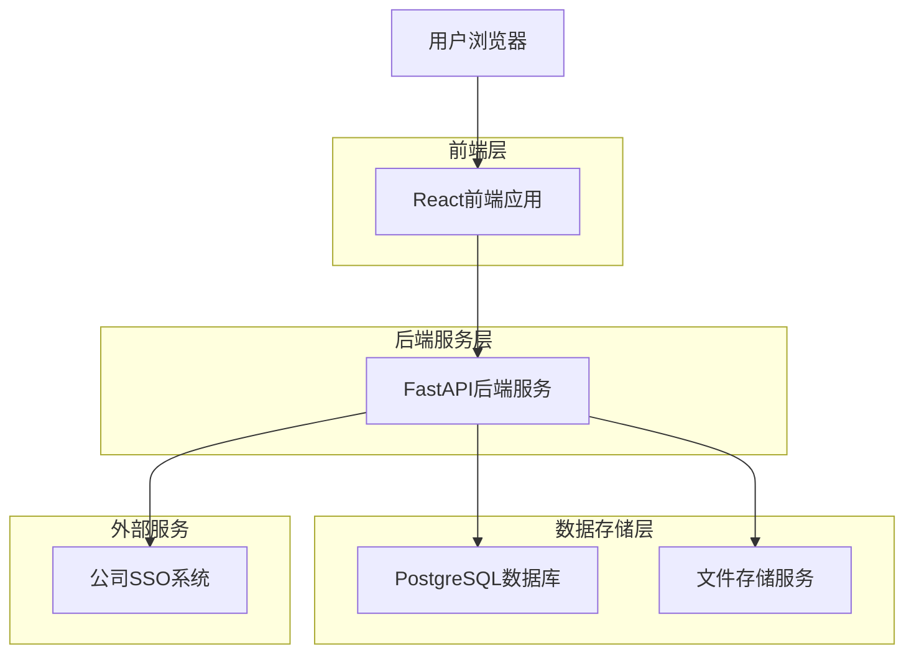
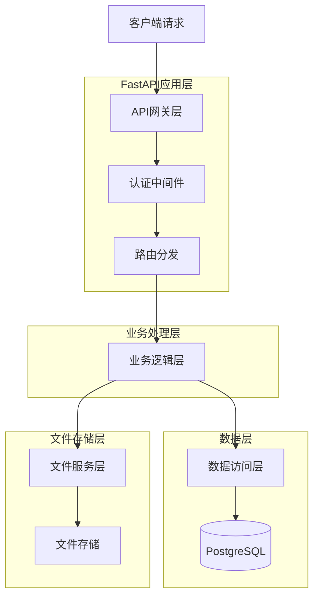
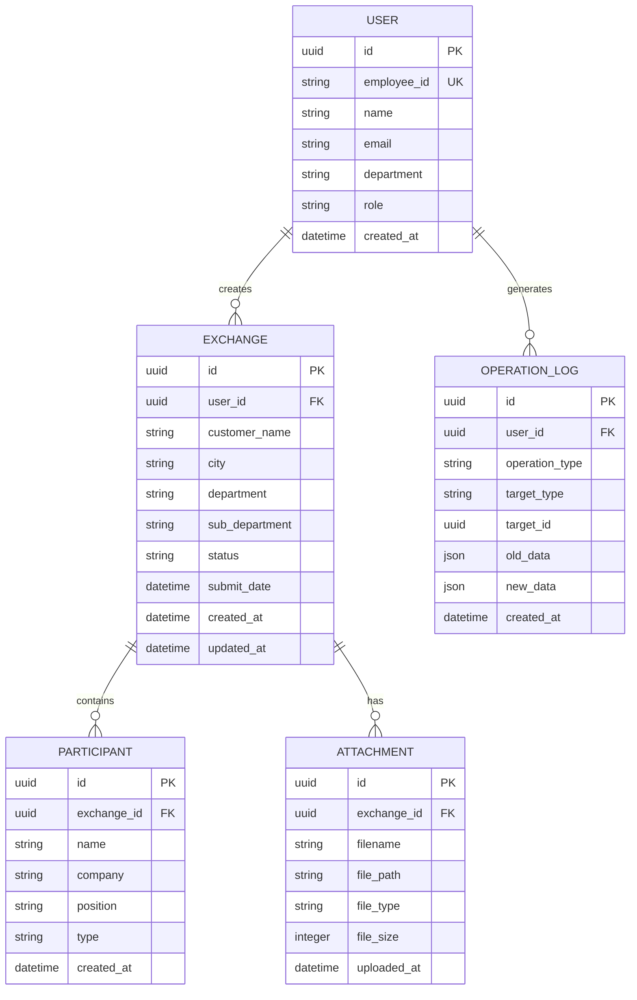

## 1. 架构设计



## 2. 技术栈描述

- **前端**: React@18 + TypeScript + Ant Design@5 + Axios
- **初始化工具**: create-react-app
- **后端**: FastAPI@0.104 + Python@3.11 + SQLAlchemy@2.0
- **数据库**: PostgreSQL@15 + Redis@7(缓存)
- **文件存储**: 本地存储/MinIO(可选)
- **认证**: OAuth2.0 + 公司SSO集成

## 3. 路由定义

| 路由 | 用途 |
|------|------|
| / | 首页，个人记录列表 |
| /login | SSO登录页面 |
| /register | 新用户注册(如需要) |
| /exchange/new | 新建交流登记 |
| /exchange/:id | 交流记录详情 |
| /exchange/:id/edit | 编辑交流记录 |
| /admin | 管理员后台 |
| /export | 数据导出页面 |
| /profile | 用户个人信息 |

## 4. API定义

### 4.1 认证相关API

**SSO登录验证**
```
POST /api/auth/sso-login
```

请求参数:
| 参数名 | 参数类型 | 必填 | 描述 |
|--------|----------|------|------|
| sso_token | string | 是 | SSO系统返回的令牌 |
| employee_id | string | 是 | 员工工号 |

响应:
| 参数名 | 参数类型 | 描述 |
|--------|----------|------|
| access_token | string | JWT访问令牌 |
| refresh_token | string | 刷新令牌 |
| user_info | object | 用户信息 |
| role | string | 用户角色 |

### 4.2 交流记录API

**创建交流记录**
```
POST /api/exchanges
```

请求体:
```json
{
  "customer_name": "客户公司",
  "city": "北京",
  "department": "技术部",
  "sub_department": "前端组",
  "participants": {
    "external": [{"name": "张三", "position": "经理"}],
    "internal": [{"employee_id": "E001", "name": "李四"}]
  },
  "attachments": ["file1.pdf", "file2.jpg"]
}
```

**获取个人记录列表**
```
GET /api/exchanges/my?page=1&size=10&status=all
```

**管理员获取全部记录**
```
GET /api/exchanges/admin?page=1&size=10&search=&status=&date_from=&date_to=
```

**更新记录状态(锁定/解锁)**
```
PUT /api/exchanges/:id/status
```

### 4.3 文件上传API

**上传附件**
```
POST /api/upload/attachment
```

请求格式: multipart/form-data
文件限制: 单文件<10MB, 支持jpg/png/pdf/doc/docx

## 5. 服务器架构设计



## 6. 数据模型

### 6.1 实体关系图



### 6.2 数据定义语言

**用户表 (users)**
```sql
CREATE TABLE users (
    id UUID PRIMARY KEY DEFAULT gen_random_uuid(),
    employee_id VARCHAR(20) UNIQUE NOT NULL,
    name VARCHAR(100) NOT NULL,
    email VARCHAR(255) UNIQUE NOT NULL,
    department VARCHAR(100),
    sub_department VARCHAR(100),
    role VARCHAR(20) DEFAULT 'user' CHECK (role IN ('user', 'admin')),
    is_active BOOLEAN DEFAULT true,
    created_at TIMESTAMP WITH TIME ZONE DEFAULT NOW(),
    updated_at TIMESTAMP WITH TIME ZONE DEFAULT NOW()
);

CREATE INDEX idx_users_employee_id ON users(employee_id);
CREATE INDEX idx_users_department ON users(department);
```

**交流记录表 (exchanges)**
```sql
CREATE TABLE exchanges (
    id UUID PRIMARY KEY DEFAULT gen_random_uuid(),
    user_id UUID NOT NULL REFERENCES users(id),
    customer_name VARCHAR(200) NOT NULL,
    city VARCHAR(100) NOT NULL,
    department VARCHAR(100) NOT NULL,
    sub_department VARCHAR(100),
    status VARCHAR(20) DEFAULT 'active' CHECK (status IN ('active', 'locked', 'deleted')),
    submit_date DATE NOT NULL,
    created_at TIMESTAMP WITH TIME ZONE DEFAULT NOW(),
    updated_at TIMESTAMP WITH TIME ZONE DEFAULT NOW()
);

CREATE INDEX idx_exchanges_user_id ON exchanges(user_id);
CREATE INDEX idx_exchanges_status ON exchanges(status);
CREATE INDEX idx_exchanges_submit_date ON exchanges(submit_date);
```

**参与人表 (participants)**
```sql
CREATE TABLE participants (
    id UUID PRIMARY KEY DEFAULT gen_random_uuid(),
    exchange_id UUID NOT NULL REFERENCES exchanges(id) ON DELETE CASCADE,
    name VARCHAR(100) NOT NULL,
    company VARCHAR(200),
    position VARCHAR(100),
    type VARCHAR(20) CHECK (type IN ('external', 'internal')),
    employee_id VARCHAR(20),
    created_at TIMESTAMP WITH TIME ZONE DEFAULT NOW()
);

CREATE INDEX idx_participants_exchange_id ON participants(exchange_id);
CREATE INDEX idx_participants_type ON participants(type);
```

**附件表 (attachments)**
```sql
CREATE TABLE attachments (
    id UUID PRIMARY KEY DEFAULT gen_random_uuid(),
    exchange_id UUID NOT NULL REFERENCES exchanges(id) ON DELETE CASCADE,
    filename VARCHAR(255) NOT NULL,
    file_path VARCHAR(500) NOT NULL,
    file_type